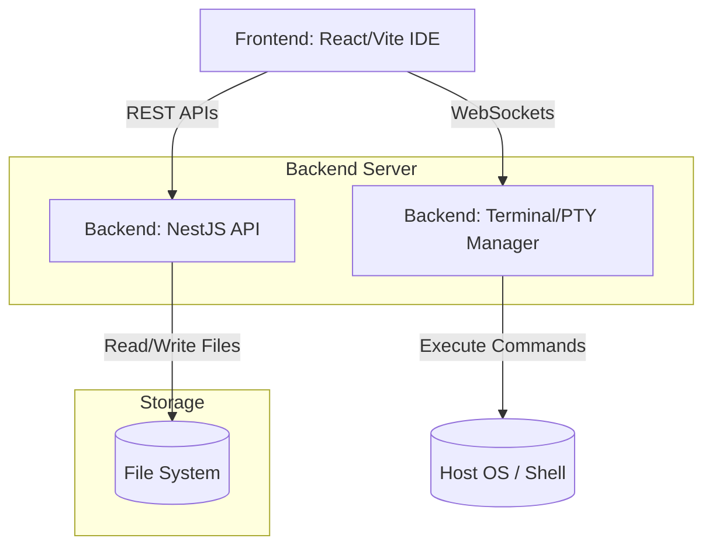

# YUVRO AI - Web IDE Platform

Welcome to **YUVRO AI**, a powerful, cloud-based Integrated Development Environment (IDE) built for the web. YUVRO AI allows users to manage multiple projects from a central dashboard, edit code in a feature-rich browser editor, execute scripts in an integrated terminal, and inspect data effortlessly.

## 🌟 Key Features

- **Project Dashboard**: A central hub to manage, create, and select projects.
- **Web-Based Code Editor**: Powered by Monaco Editor (the same core as VS Code) for a premium, syntax-highlighted coding experience.
- **Integrated Terminal**: Fully functional terminal directly in your browser using xterm.js, allowing you to run Node.js, Python, or framework development servers.
- **Real-Time File Explorer**: A visual tree view of your project's files and directories.
- **Database Viewer**: Built-in tab to easily inspect local data sources alongside your code.
- **Isolated Workspaces**: Projects are neatly organized into isolated folders on the backend.

---

## 🏗️ Architecture & Data Flow

YUVRO AI follows a classic Client-Server architecture with real-time bidirectional communication for terminal and file system operations.



### 1. Frontend (The Client)
The frontend is responsible for rendering the IDE UI. When a user opens a project, the React app fetches the file tree from the backend via REST API. When the user edits and saves a file, the new content is sent back to the backend.

### 2. Backend (The Server)
The NestJS backend acts as the bridge to the local filesystem and operating system. It handles:
- Serving file trees, reading file contents, and saving files.
- Spawning child processes (like `node` or `python` commands) when the user clicks "Run".
- Pumping terminal output back to the frontend via WebSockets (Socket.IO).

### 3. Workspaces Storage (`backend/.workspaces`)
The core of project isolation happens inside the `backend/.workspaces` directory. 
- Every project created or imported into YUVRO AI exists as a distinct subdirectory here (e.g., `demo-django/`, `demo-fastapi/`). 
- When the IDE requests the file tree for "demo-django", the backend strictly scopes its reads and writes to `backend/.workspaces/demo-django`.
- A global `launch.json` configuration file can also reside here to define custom run commands for specific files or project types.

---

## 💻 Tech Stack

### Frontend
- **Framework**: React 19 + TypeScript + Vite
- **Code Editor**: `@monaco-editor/react`
- **Terminal UI**: `@xterm/xterm` (with xterm-addon-fit)
- **Icons & Styling**: `lucide-react` for iconography, custom vanilla CSS for high-performance and dynamic layouts.
- **Real-Time Comm**: `socket.io-client`

### Backend
- **Framework**: NestJS (Node.js) + TypeScript
- **Real-Time Comm**: Socket.IO / WebSockets (via NestJS Gateways)
- **OS Integration**: Node.js `child_process` and `fs` modules.

---

## 🚀 Getting Started

### 1. Start the Backend
```bash
cd backend
npm install
npm run start:dev
```
*The backend runs on `http://localhost:3000`.*

### 2. Start the Frontend
```bash
cd frontend
npm install
npm run dev
```
*The frontend runs on `http://localhost:5173`.*

Open `http://localhost:5173` in your browser to access the YUVRO AI dashboard and start coding!
